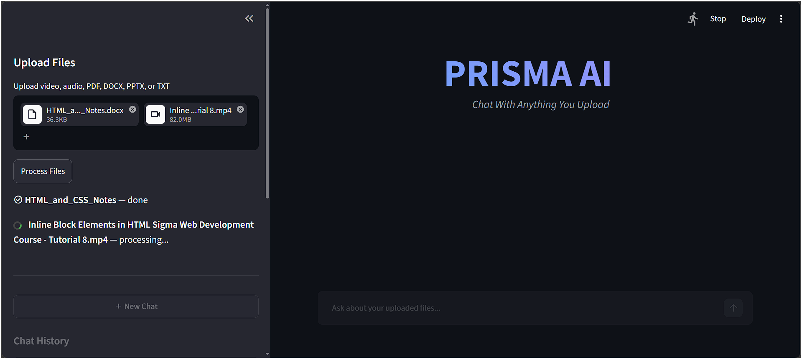
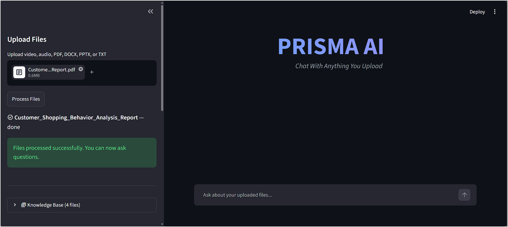
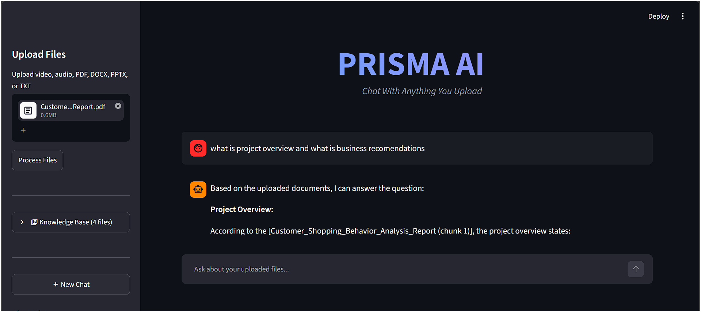
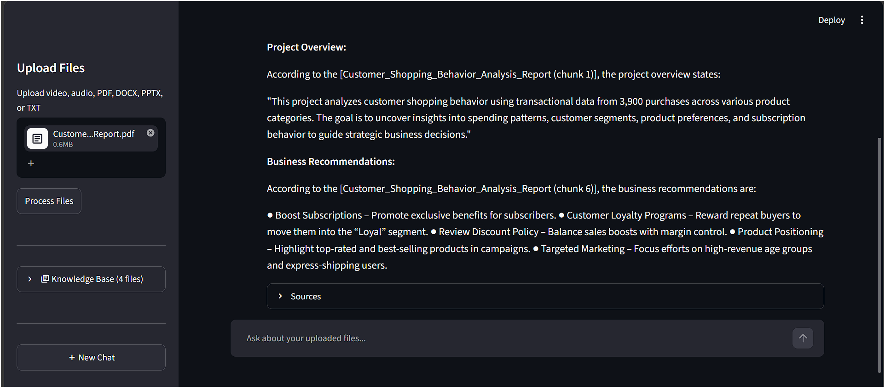
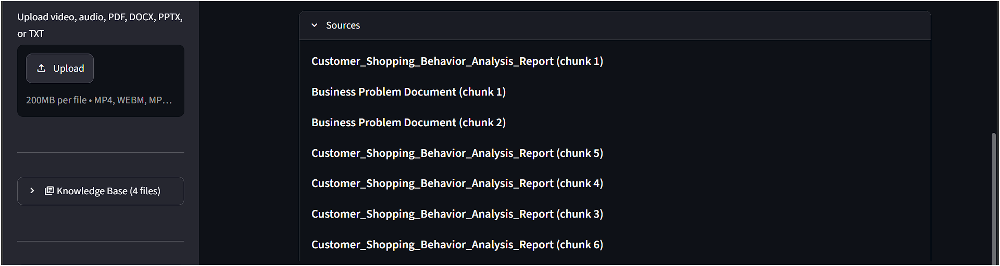
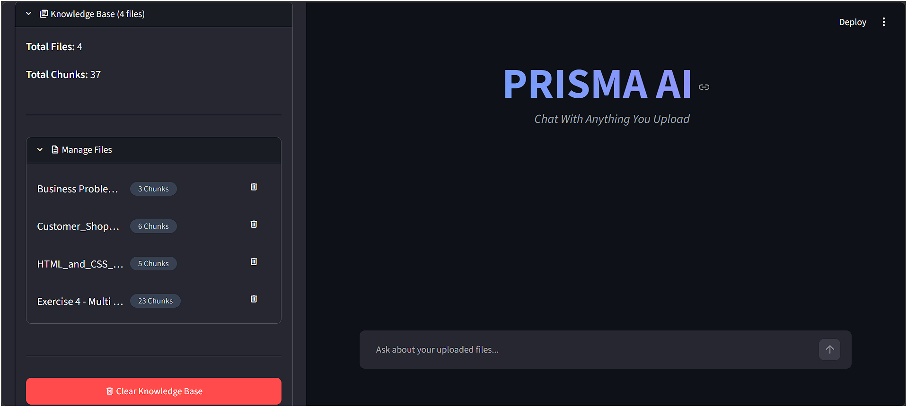
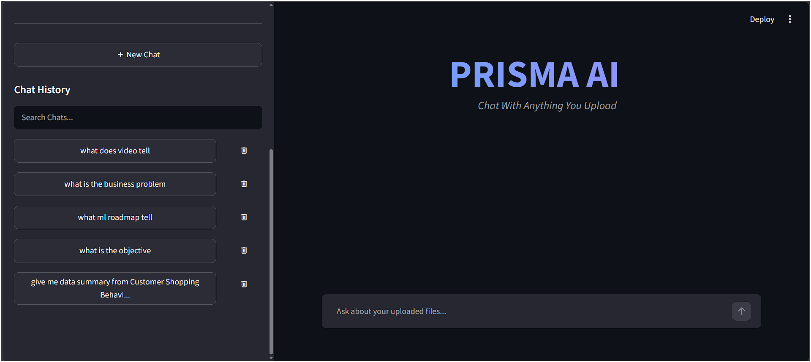

<div align="center">

# 🧠 PRISMA AI
### *Chat With Anything You Upload*

**A Multi-Modal Retrieval-Augmented Generation (RAG) Assistant**

Upload videos, audio, PDFs, Word documents, PowerPoint slides, or plain text — then have a real, grounded conversation with their content. Every answer is generated strictly from what you uploaded, with clear citations pointing back to the exact source.

</div>

---

## 📌 Overview

PRISMA AI is an end-to-end multi-modal RAG system that unifies six different file types into a single, coherent knowledge base. Upload a lecture video, a research PDF, and a set of meeting slides together — and ask questions that draw from all of them at once, with every claim traceable back to its exact origin: a video timestamp, a document section, or a specific file.

This is not a single-format chatbot with a RAG label attached. It is a complete pipeline — speech-to-text transcription, multi-format document parsing, semantic chunking, vector embedding, similarity search, and LLM-based answer synthesis — designed with the same rigor as a production system: predictable behavior, graceful failure handling, and a clean, maintainable architecture.

---

## ✨ Core Features

- 🎬 **Video & Audio Understanding** — automatic transcription with translation to English and precise timestamp tracking for every spoken segment
- 📄 **True Multi-Format Document Support** — PDF, DOCX, PPTX, and TXT parsed natively through format-specific libraries, no lossy conversions
- 📦 **Unified Multi-File Batches** — upload a video, several PDFs, and an audio file together in one batch; each is tracked, processed, and indexed independently
- 🔍 **Relevance-Filtered Semantic Search** — vector similarity search with a distance-based cutoff, ensuring only genuinely relevant content ever reaches an answer
- 📎 **Fully Grounded Citations** — every answer links back to its precise source: 🎬 a timestamp for media, 📄 a file name for documents
- 💬 **Persistent, Multi-Session Chat History** — a sidebar of auto-titled, switchable conversations that survive app restarts
- 🗂️ **Knowledge Base Management Panel** — a collapsible control center showing total files and chunks, with per-file deletion and a confirmation-gated full reset
- ⏳ **Live, Per-File Processing Feedback** — animated progress indicators that update independently for every file in a batch
- 🛡️ **Defensive Engineering Throughout** — every file parse, external API call, and I/O operation is wrapped in explicit error handling with clear, human-readable messages instead of silent failures or crashes

---

## 🏗️ System Architecture

```
                         ┌────────────────────────┐
                         │   Streamlit Frontend     │
                         │  (upload · chat · panel) │
                         └────────────┬─────────────┘
                                      │
                         ┌────────────▼─────────────┐
                         │       backend.py          │
                         │   (zero UI dependencies)  │
                         └────────────┬─────────────┘
                                      │
        ┌─────────────────┬──────────┼──────────┬─────────────────┐
        ▼                 ▼          ▼          ▼                 ▼
   ┌─────────┐      ┌───────────┐ ┌──────┐ ┌──────────┐    ┌────────────┐
   │ FFmpeg  │──────▶│  Whisper  │ │PyMuPDF│ │python-docx│    │python-pptx │
   │ (video) │      │ (speech→  │ │ (PDF) │ │  (Word)   │    │ (slides)   │
   │         │      │  English) │ │       │ │           │    │            │
   └─────────┘      └─────┬─────┘ └───┬──┘ └─────┬────┘    └─────┬──────┘
                           └───────────┴──────────┴───────────────┘
                                        │
                                        ▼
                          ┌──────────────────────────┐
                          │    Size-Aware Chunking     │
                          │  short docs → 1 chunk      │
                          │  long docs → 800 chars,    │
                          │  150-char overlap          │
                          └────────────┬─────────────┘
                                       ▼
                          ┌──────────────────────────┐
                          │  all-MiniLM-L6-v2 Embedder │
                          │      (384-dim vectors)     │
                          └────────────┬─────────────┘
                                       ▼
                          ┌──────────────────────────┐
                          │   FAISS IndexFlatL2        │
                          │  + EMBED_VERSION stamp     │
                          └────────────┬─────────────┘
                                       ▼
                              User asks a question
                                       │
                                       ▼
                          ┌──────────────────────────┐
                          │  Similarity Search +       │
                          │  max_distance Relevance    │
                          │  Filtering                 │
                          └────────────┬─────────────┘
                                       ▼
                          ┌──────────────────────────┐
                          │   Groq API — Llama 3.1 8B  │
                          │  (context-grounded answer) │
                          └────────────┬─────────────┘
                                       ▼
                        Cited Answer → Chat History (persisted)
```

**Clean separation of concerns:** `backend.py` contains every piece of processing logic — extraction, chunking, embedding, retrieval, and generation — with zero Streamlit or UI dependencies. It is fully independent and testable on its own. `frontend.py` handles only presentation, calling into the backend for everything else. This is a deliberate architectural choice, not an accident of how the code evolved.

---

## 🛠️ Tech Stack

| Layer | Technology | Purpose |
|---|---|---|
| Interface | **Streamlit** | Interactive upload and chat experience |
| Speech-to-Text | **OpenAI Whisper** | High-quality transcription with automatic translation |
| Media Conversion | **FFmpeg** | Reliable video-to-audio extraction |
| Embeddings | **Sentence-Transformers** (`all-MiniLM-L6-v2`) | Fast, high-quality 384-dimensional semantic vectors |
| Vector Search | **FAISS** (`IndexFlatL2`) | Purpose-built, high-performance similarity search |
| LLM Inference | **Groq API** (`llama-3.1-8b-instant`) | Fast, cloud-hosted answer generation |
| Document Parsing | **PyMuPDF · python-docx · python-pptx** | Native, format-specific text extraction |

---

## 🧠 Engineering Highlights

**Size-aware, context-preserving chunking**
Rather than splitting every document into uniform blocks, PRISMA AI evaluates each document's length first. Short documents are kept whole, preserving full context in a single embedding. Longer documents are split with overlapping boundaries, so no fact — a name, a figure, a conclusion — is ever severed across a chunk boundary and lost to retrieval.

**Version-stamped vector indexes**
Every embedding index is tagged with the exact chunking and embedding configuration used to build it. If that configuration ever changes, the system detects the mismatch and prevents stale, silently-incompatible vectors from producing quietly wrong search results — a safeguard most RAG projects skip entirely.

**Relevance-filtered retrieval**
Search results aren't just "the closest k matches" — they're filtered against a distance threshold, so a question about one document never surfaces unrelated content from another simply because nothing better was available. This keeps every answer tightly grounded in what's actually relevant.

**Defensive, production-style error handling**
Every processing step — file extraction, transcription, embedding, LLM calls — is wrapped in explicit exception handling that reports clear, specific failures instead of crashing. A single corrupted upload never interrupts the rest of a batch.

**Decoupled backend architecture**
The entire retrieval and generation pipeline lives in a UI-independent backend module, callable and testable on its own. This reflects a deliberate engineering discipline: logic and presentation are never entangled.

---

## 📁 Project Structure

```
PRISMA_AI/
├── frontend.py               # Streamlit UI — uploads, chat, sidebar, Knowledge Base panel
├── backend.py                 # Core logic — extraction, chunking, embeddings, search, LLM calls
├── metadata_utils.py          # Collision-proof file ID + metadata generation
├── extract_documents.py       # PDF / DOCX / PPTX / TXT text extraction
├── process_video.py           # Video → audio conversion + transcription pipeline
├── process_audio.py           # Standalone audio transcription pipeline
├── process_documents.py       # Document extraction + chunking pipeline
├── create_chunks.py           # Batch transcript chunking utility
├── create_embeddings.py       # Batch embedding + FAISS index builder
├── search.py                  # Standalone retrieval testing utility
├── qa.py                      # Standalone Q&A testing utility
├── screenshots                # Screenshots of working web application       
├── requirements.txt
├── .gitignore


```

---

## 🧩 How It Works — End to End

1. **Upload** — one or more files of any supported type are submitted through the interface
2. **Extraction** — video and audio are transcribed and translated to English via Whisper; documents are parsed by their format-native library
3. **Chunking** — extracted text is split into semantically coherent pieces, sized according to the content's length and structure
4. **Embedding** — each chunk becomes a 384-dimensional vector representing its meaning
5. **Indexing** — vectors are stored in FAISS alongside rich metadata, and the index is stamped with its build configuration
6. **Querying** — a user's question is embedded using the same model, placing it in the same vector space as every stored chunk
7. **Retrieval** — FAISS returns the closest matches, filtered against a relevance threshold to exclude weak or unrelated results
8. **Generation** — retrieved chunks are passed to Groq's Llama model with an explicit instruction to answer only from the supplied context
9. **Response** — the final answer is displayed with clear, clickable source citations

---
## 📸 Screenshots

### Multi-File Upload with Live Progress



### Grounded, Cited Answers With Sources




### Knowledge Base Management


### New Chat & Persistent Chat History 


---

## 🧪 Reliability & Quality

PRISMA AI was built and tested against real-world edge cases, not just the happy path:

- ✅ Corrupted or unreadable files are caught and reported clearly — a single bad file never interrupts the rest of a batch
- ✅ Empty or image-only documents are flagged rather than silently indexed as blank content
- ✅ Questions asked before any content is uploaded return a clear, friendly message
- ✅ Duplicate filenames are handled correctly through collision-proof internal identifiers
- ✅ Missing or invalid credentials are detected on load without breaking the rest of the app
- ✅ Knowledge base deletions require explicit confirmation, protecting against accidental, irreversible data loss
- ✅ Stale indexes built under an outdated configuration are detected before being trusted

---

## 🔮 Roadmap

- [ ] Multilingual embedding support for non-English document retrieval
- [ ] OCR pipeline for scanned and image-based documents
- [ ] Per-user authentication with isolated, private knowledge bases
- [ ] Incremental index updates for faster re-embedding on large knowledge bases

---

## 🖥️ Getting Started

### Prerequisites
- Python 3.10+ (Tested and built on Python 3.12.13)
- [FFmpeg](https://ffmpeg.org/download.html) installed and available on your system PATH
- A free [Groq API key](https://console.groq.com)

### Installation

```bash
https://github.com/Priyanshibarar22/prisma-ai-multimodal-rag.git
cd PRISMA_AI
pip install -r requirements.txt
```

### Configuration

Create a `.env` file in the project root:
```env
GROQ_API_KEY=your_groq_api_key_here
```

### Run

```bash
streamlit run frontend.py
```

The app opens automatically at `http://localhost:8501`.

---

<div align="center">

### 👤 Built by Priyanshi Barar

*An end-to-end exploration of Retrieval-Augmented Generation and multi-modal AI systems — from raw file to grounded, cited answer.*

</div>
